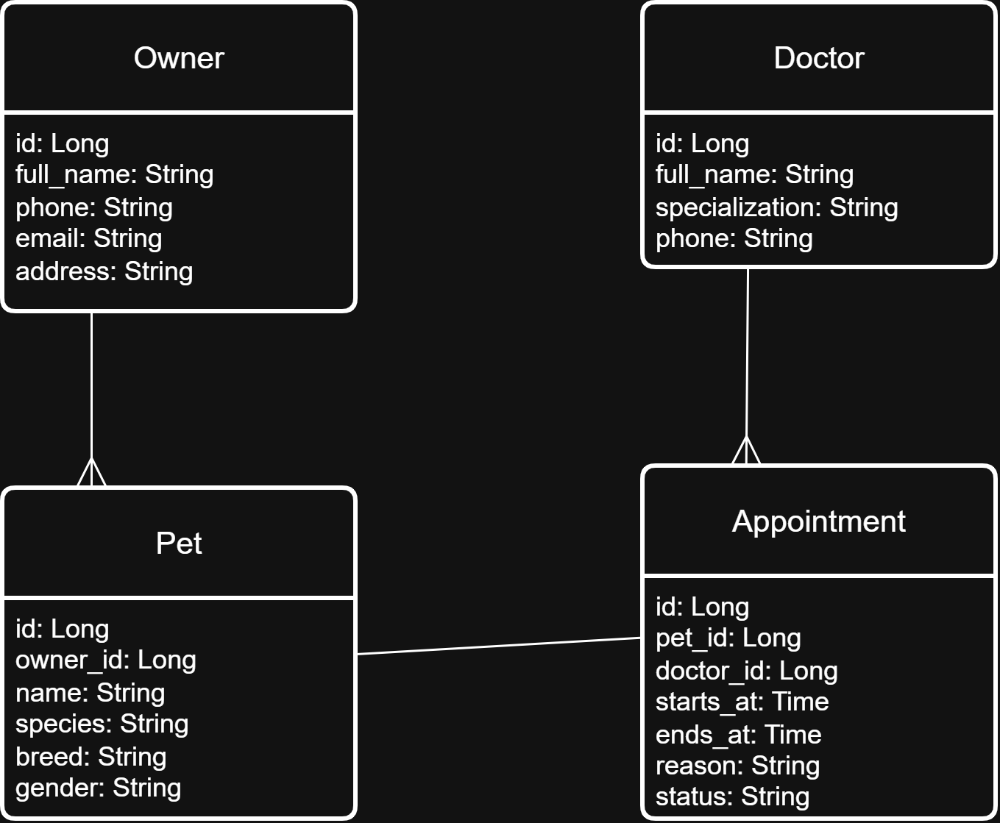

# Veterinary Clinic

Консольная информационная система для управления ветеринарной клиникой.  

Поддерживаются роли:
- Администратор
- Владелец питомца
- Доктор

# Развёртывание базы данных

В проекте присутствует файл:

schema.sql

## 1. Создать базу данных

```bash
createdb -U postgres VeterinaryClinic
```

## 2. Импортировать схему

```bash
psql -U postgres -d VeterinaryClinic -f schema.sql
```
**Не забудьте указать свои данные подключения к базе данных в файле `db.properties.example` и удалить `.example` в имени файла.**

# Сборка и запуск приложения

## Сборка

```bash
mvn clean package
```

## Запуск через Maven

```bash
mvn exec:java
```

## Или запуск JAR

```bash
java -jar target/*.jar
```

---

# Данные для входа

| Роль | Логин |
|------|-----------|
| Администратор | admin |
| Владелец питомца | 123456789 |
| Доктор | 987654321 |

---

# Возможности пользователей

## Владелец питомца
Может:
- просматривать свои записи на приём
- просматривать список своих питомцев
- редактировать питомцев
- просматривать список докторов
- записываться к врачу
- переносить запись
- отменять запись

---

## Доктор
Может:
- просматривать своё расписание
- просматривать карточки пациентов
- изменять статус записи

---

## Администратор

### Owners
- список владельцев
- добавить владельца
- обновить владельца
- удалить владельца

### Doctors
- список врачей
- добавить врача
- обновить врача
- удалить врача

### Pets
- список питомцев
- добавить питомца
- обновить питомца
- удалить питомца

### Appointments
- список записей
- добавить запись
- обновить запись
- удалить запись
- изменить статус записи

---

# Бизнес-правила

- Нельзя записаться к врачу, если в это время уже есть активная запись
- Телефон проходит проверку (от 9 до 15 символов)
- Телефоны владельцев и врачей уникальны

---

# Физическая схема БД



---
